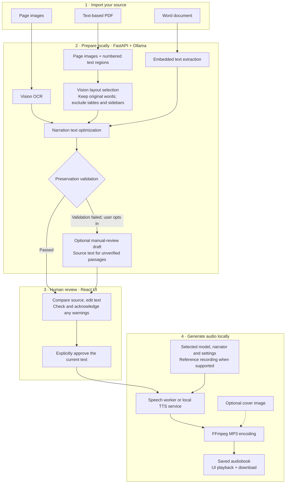

# Local Audible

Turn your own book pages and documents into locally generated audiobooks, with human review before narration.

Local Audible combines React, FastAPI, local Ollama models and multiple speech engines. It is an independent project, not affiliated with Audible or Amazon.

## Features

- Import image folders, text-based PDFs and Word .docx documents.
- Analyze PDF page images and positioned text together to exclude tables, figures, captions and sidebars while retaining the original words.
- Optimize punctuation and paragraph breaks, then review and edit the text.
- Choose English narrators, model-specific controls and supported reference voices.
- Compare settings with an optional ten-second preview using a shared passage.
- Export MP3 audiobooks with optional cover artwork, playback and download.

This is experimental AI-assisted preparation. Layout selection, transcription and speech can make mistakes. Compare important text with the source. British presets are excluded, but generated/cloned accents cannot be guaranteed.

## System design

The React interface talks to a single FastAPI process, which coordinates preparation, review, local speech workers and file storage. The main audiobook path is shown below.



**Preservation, not re-transcription:** PDF selection chooses region IDs; the app assembles their original embedded words. Its narration audit compares against that selected text, not the excluded tables or sidebars. Uncertain regions are retained with warnings. Unreadable inputs and incomplete layout classification stop preparation rather than publishing a partial book.

**Your approval is the boundary:** no LLM edits occur after approval. The optional ten-second voice preview is independent of this book-approval path. Original files, text revisions, selection reports and audio stay in the local `data/` workspace by default; downloads may contact model hosts, and a configured remote Ollama endpoint receives preparation inputs.

See [architecture and configuration](docs/architecture.md) for module boundaries, limits and caching. The separate CLI supports image OCR and Kokoro WAV output.

## Requirements

Primary development platform: **macOS on Apple Silicon, Python 3.12**. MLX engines and automatic reference transcription require Apple Silicon. Other platforms and optional adapters are not comprehensively validated.

- Python 3.12; Node.js 22.12+ or compatible newer LTS.
- [Ollama](https://ollama.com/) with an installed vision-capable model for image/PDF preparation.
- FFmpeg and ffprobe on PATH; eSpeak NG if required by your Kokoro phonemizer.
- Internet for installation/first-use downloads, and sufficient RAM/disk for the chosen checkpoints.

On macOS, `brew install ffmpeg espeak-ng` installs the media/phonemizer prerequisites. No books, voice recordings or model weights are distributed here.

## Quick start

Clone the repository and open its root directory:

```sh
python3.12 -m venv .venv312
.venv312/bin/python -m pip install -e '.[dev,kokoro]'
npm ci
cp .env.example .env
```

Start Ollama, run `ollama list`, and set `OLLAMA_MODEL` in .env to the **exact installed vision-model tag** you want. The example tag is a development configuration, not a bundled model or a promise of public registry availability. Pull your chosen model separately if necessary.

Start the API:

```sh
.venv312/bin/python -m uvicorn backend.main:app --host 127.0.0.1 --port 8000
```

In a second terminal:

```sh
npm run dev -- --host 127.0.0.1 --port 5173
```

Open **http://127.0.0.1:5173**. Keep services on loopback: this single-user app has no authentication and is not a public web service. `npm run build` builds the frontend; it does not configure production hosting.

## Workflow

1. **Source:** choose page images in filename order, or upload a PDF/Word document.
2. **Prepare:** run optimization. PDF layout progress appears page by page, then text preparation passage by passage. Use **Review text now** when ready.
3. **Cover (optional):** upload JPG, PNG or WebP artwork.
4. **Approve:** choose model/narrator, optionally prepare a reference and preview, then approve the exact editor text for narration.

No LLM editing occurs after approval. Preview generation is never required. Weight loading and final MP3 encoding may take time beyond passage synthesis.

After a preservation failure, **Review text with warnings** can open a complete manual-review draft: validated passages plus source text for unverified passages. Acknowledgment is required before audio approval; this does not declare failed optimization successful. Incomplete layout classification and unreadable sources remain errors.

PDF selection reports and selected text are downloadable. Uncertain regions remain with warnings. Scanned PDFs require the image workflow; convert legacy .doc to .docx. Word sections are not fixed rendered pages.

## Speech engines

Kokoro is the simplest starting point. A menu entry does not mean its dependencies or checkpoints are installed or verified on your machine.

| Engine | Runtime | Voice selection |
| --- | --- | --- |
| Kokoro | Main environment | 20 US-English presets |
| Piper | .venv-speech | US-English single-speaker catalog |
| Chatterbox | MLX / Apple Silicon | Default or optional reference |
| Fish Speech S2 Pro | MLX / Apple Silicon | Reference and transcript |
| Orpheus-TTS | MLX / Apple Silicon | Tara |
| Sesame CSM-1B | MLX / Apple Silicon | Default or optional reference/transcript |
| ChatTTS | .venv-chattts | Seed-based speaker |
| F5-TTS | .venv-f5 | Reference and transcript |
| GPT-SoVITS | Separate local API | Reference and transcript |
| CosyVoice 2 | Separate local API | Reference and transcript |

See [model setup and limitations](docs/models.md).

## Local storage

The default `data/` workspace is created as needed and excluded from Git.

| Path | Contents |
| --- | --- |
| data/uploads/ | Uploaded originals |
| data/images/ | Previews, PDF layout caches and covers |
| data/text/ | Raw/selected/reviewed/approved text, reports and narration metadata |
| data/audio/ | Completed MP3s |
| data/audio/previews/ | Comparison clips |
| data/sample_voice/ | Your permitted reference recordings; create this folder yourself |
| data/audio/references/, data/references/ | Prepared excerpts/transcripts and generation snapshots |
| data/models/ | Some engine assets; others use upstream cache directories |
| data/history/, data/manifest.json | Previous/current workspace state |

Files remain until removed. Back up originals and edited manuscripts before cleaning data. The UI intentionally starts blank, rather than automatically reopening an old book.

## CLI

Independent image OCR and Kokoro WAV generation:

```sh
.venv312/bin/python -m backend.cli text --images data/images --output data/text/book.txt
# Review/edit the text before generating audio:
.venv312/bin/python -m backend.cli audio --text data/text/book.txt --output data/audio/book.wav
```

After installation, `local-audible` provides the same commands; `book-reader` remains a compatibility alias. Use --help for options. The CLI does not expose PDF layout preparation and outputs WAV, not MP3.

## Development and documentation

```sh
.venv312/bin/python -m pytest -q
npm run build
git diff --check
```

- [Architecture, configuration and limits](docs/architecture.md)
- [Contributing and browser tests](CONTRIBUTING.md)
- [Security and publication precautions](SECURITY.md)
- [Implementation summary](summary.md)

## License and responsible use

Project code: **GNU AGPL-3.0-only**, see [LICENSE](LICENSE). Engines and model weights have separate terms, including access/non-commercial restrictions; our license does not relicense them. See [THIRD_PARTY.md](THIRD_PARTY.md).

Use only books/recordings you have permission to process, and obtain speaker permission before cloning. Never publish private source material, transcripts, recordings or credentials in commits or issues.
